# Magnus Drive Inventory Management System
## Complete System Architecture & Technical Specification (A to Z)

---

### 1. Executive Overview & Design Philosophy

**Magnus Drive** is a premium, real-time, multi-godown inventory intelligence system engineered specifically for **MAGNUS AGENCIES**. The application manages high-throughput industrial and consumer equipment inventory, serialized tracking, third-party vendor stock, customer replacements (DCWR), and scrap recycling logistics. 

#### Core Philosophy
* **Extreme UI Aesthetics:** Designed using a modern "glassmorphic" theme, offering curated color states (teal, gold, accent pink, safety red) that contrast beautifully with deep neutral layouts. Fully responsive sidebar navigation is paired with highly reactive typography.
* **Local-First, Cloud-Synced:** Integrates a local state cache stored in browser `localStorage` with a debounced cloud sync pipeline using **Supabase** (Postgres), ensuring that operations are ultra-fast and latency-free, even under poor network conditions.
* **Double-Audited Transactions:** Every record insertion, deletion, modification, or system-level configuration is logged across structured tables in Supabase, capturing IP addresses and snapshots before and after the modification.

---

### 2. Core Technology Stack

| Technology Layer | Solution / Dependency | Details & Scope |
| :--- | :--- | :--- |
| **Frontend Runtime** | React 19.x | Leverages modern functional hooks, lazy-loaded components (`React.lazy`, `Suspense`), and fine-grained state updates. |
| **Bundler & Dev Server** | Vite | Ultra-fast HMR, asset loading pipelines, and optimized chunk generation. |
| **Database & Auth** | Supabase JS Client v2 | Integrates PostgreSQL tables, Views, secure RPCs, and custom app-level authentication. |
| **Styling Architecture** | Vanilla CSS (CSS variables) | Structured via `src/index.css` using modern custom variables for HSL themes, glassmorphism, transitions, custom accordion layouts, and scaling. |
| **Barcode Scanning** | `html5-qrcode` | Client-side camera-based barcode scanning to parse serial numbers, codes, and transaction bills. |
| **Excel Parsing & Export** | SheetJS (`xlsx`) | Enables seamless import and export of products, opening stock, transactions, and active state dumps. |
| **Data Visualization** | `Chart.js` & `react-chartjs-2` | Powers historical analytics, category stock velocity trends, and godown comparative reports on the Home dashboard. |
| **Alert Notification** | `react-hot-toast` | Real-time elegant notifications for operations, warnings, and error catch statements. |

---

### 3. Application Directory Structure

```
Magnus_Drive/
├── supabase_schema_overhaul.sql      # Single-run master SQL script for database structures
├── package.json                       # Core dependencies, scripts (vite dev, build, preview)
├── vite.config.js                    # Vite server configurations & aliases
├── public/                           # Static assets (icons, images)
└── src/
    ├── App.jsx                       # Master Router, Theme, Auth, and Inventory Context provider wraps
    ├── main.jsx                      # React 19 Client Root mounting point
    ├── index.css                     # Main stylesheet (themes, glassmorphism, table layout rules)
    ├── components/
    │   ├── BarcodeScanner.jsx        # HTML5 camera module for instant stock serial inputs
    │   ├── BillPreviewModal.jsx      # Thermal-style printable Challan/Bill invoice rendering
    │   ├── CategoryAccordion.jsx     # Dropdown categorizer with search filters & action totals
    │   ├── Header.jsx                # Theme picks, godown switch, DB backup triggers, and cloud sync indicators
    │   └── ThemePicker.jsx           # Interface for HSL color presets (Light/Dark themes)
    ├── context/
    │   ├── AuthContext.jsx           # Role assignments, Supabase auth bridge, IP tracker, and profile mappings
    │   ├── InventoryContext.jsx      # Core Business Logic, FIFO engines, state mutations, and Cloud Synchronizer
    │   └── ThemeContext.jsx          # Custom variable CSS injector for multi-theme configurations
    ├── lib/
    │   ├── dateUtils.js              # Multi-format DD/MM/YYYY date standardization engine
    │   └── supabase.js               # Supabase JS client client instantiation (URL & Anon Keys)
    └── pages/
        ├── Login.jsx                 # Glassmorphic user login interface with fallback legacy auth bridges
        ├── Dashboard.jsx             # Shell wrapper handling lazy components, tab routes, and system-wide file backups
        └── dashboard/
            ├── Activity.jsx          # Structured system audits, action tracking, and administrator insights
            ├── Adjustments.jsx       # Manual damage, surplus, and scrap auto-routing stock modifiers
            ├── Dcwr.jsx              # Outstanding replace tracking (Challan OUT vs replacement IN)
            ├── Home.jsx              # Analytics panels, velocity trends, low stock warnings, and comparative graphs
            ├── Opening.jsx           # Master opening stock manager mapped by godown and product
            ├── Parties.jsx           # CRM-style client, dealer, and supplier directory
            ├── Products.jsx          # Inventory ledger manager for codes, categories, and min-stock levels
            ├── Purchases.jsx         # Inward ledger processing, serial registrations, and bill edits
            ├── Sales.jsx             # Outward inventory logs, scrap returns, serial scanning, and third-party allocations
            ├── ScrapTracker.jsx      # Scrap ledger (recoverable status, scrap disposition, and disposal value)
            ├── SmartImport.jsx       # Advanced CSV/Excel batch migrator with schema alignment previewers
            ├── Statement.jsx         # Tabular combined matrix detailing opening, purchase, sales, and scrap totals
            ├── ThirdPartyStock.jsx   # Ledger for items assigned to third-party godowns
            ├── Transfers.jsx         # Inter-godown transport log (Vasai ↔ Virar)
            └── Users.jsx             # Secure administrator utility for user provisioning and credential adjustments
```

---

### 4. Database Schema (Supabase PostgreSQL Details)

All data is structured across highly optimized Postgres tables. Row-Level Security (RLS) is disabled at the database layer because authentication, profile evaluation, and permission gates are executed securely at the application context level.

#### Entity Relationship Diagram (Conceptual)

```mermaid
erDiagram
    app_users {
        text id PK
        text name
        text login_id
        text role
        text godown
        text color
    }
    products {
        text id PK
        text code
        text category
        integer min_stock
        integer order_index
    }
    parties {
        text id PK
        text name
    }
    sales {
        text id PK
        text godown
        text date
        text bill
        text party
        text type
        jsonb items
        boolean scrap_provided
        jsonb scrap_items
        text remark
        text third_party_source
        text third_party_entry_id
        jsonb serial_numbers_by_product
    }
    purchases {
        text id PK
        text godown
        text date
        text bill
        text party
        text type
        jsonb items
        text remark
        jsonb serial_numbers_by_product
    }
    dcwr_out {
        text id PK
        text godown
        text date
        text challan
        text party
        text remark
        jsonb items
    }
    dcwr_in {
        text id PK
        text godown
        text ref_out_id FK
        text date
        text remark
        jsonb items
    }
    transfers {
        text id PK
        text date
        text from_godown
        text to_godown
        text ref_no
        text remark
        jsonb items
    }
    adjustments {
        text id PK
        text godown
        text date
        text type
        text reason
        jsonb items
    }
    opening_stock {
        text product_id PK, FK
        text godown PK
        integer qty
    }
    third_party_entries {
        text id PK
        text godown
        text date
        text bill
        text party
        text type
        text status
        jsonb items
        jsonb consumed_items
        jsonb consumed_by_sales
        jsonb serial_numbers_by_product
        text remark
        timestamptz created_at
    }
    scrap_logs {
        text id PK
        text date
        text godown
        text product_id FK
        jsonb items
        integer qty
        text reason
        boolean recoverable
        text remark
        text status
        numeric disposal_value
        text source
        text source_ref_id
        timestamptz created_at
    }
    serial_numbers {
        text id PK
        text serial
        text product_id FK
        text transaction_type
        text transaction_id
        text date
        text godown
        text party
        text bill
        timestamptz created_at
    }
    activity_log {
        bigint id PK
        text time
        text user_name
        text login_id
        text role
        text action
        text details
        text module
        text ref_id
        text ref_bill
        text party
        text godown
        text ip_address
        jsonb before_snapshot
        jsonb after_snapshot
        timestamptz created_at
    }
    app_settings {
        text key PK
        jsonb value
    }

    dcwr_in }|--|| dcwr_out : ref_out_id
    opening_stock }|--|| products : product_id
    scrap_logs }|--|| products : product_id
    serial_numbers }|--|| products : product_id
```


---

### 5. Detailed Table Dictionary

#### 5.1 `products`
Holds the centralized catalog of item records.
* `id` (text, PK): Generated client-side unique string identifier (represented as alphanumeric uid: e.g., `lp5s26k`).
* `code` (text): Unique short SKU representation used on invoices/searches (e.g., `M-50`, `V-24`).
* `category` (text): Structural grouping used for accordion drawers (e.g., `Tubular Batteries`, `Inverters`).
* `min_stock` (integer): Threshold used for automatic dashboard warnings. Default is `0`.
* `order_index` (integer): Sorting sequence weight. Default is `0`.

#### 5.2 `parties`
The directory of dealers, suppliers, and retail customers.
* `id` (text, PK): Random uid.
* `name` (text): Unique name string.

#### 5.3 `sales`
Outward stock log ledger.
* `id` (text, PK): Alphanumeric record uid.
* `godown` (text): Origin stock warehouse. Default is `'1 Vasai'`.
* `date` (text): Format `YYYY-MM-DD` for chronological sorting.
* `bill` (text): Invoice / Challan reference number.
* `party` (text): Destination client or dealer name.
* `type` (text): Mode classification (`'Normal'`, `'Scheme'`, `'Pro-rata'`, `'Service'`).
* `items` (jsonb): Map of `{ "productId": quantity }` indicating quantities dispatched.
* `scrap_provided` (boolean): Flag indicating if damaged scrap was exchanged on this bill. Default is `false`.
* `scrap_items` (jsonb): Map of `{ "productId": quantity }` detailing scrap returns received.
* `remark` (text): General description.
* `third_party_source` (text, Nullable): Tracks the original third-party vendor name if stock was sourced outside.
* `third_party_entry_id` (text, Nullable): Maps back to the exact `third_party_entries.id`.
* `serial_numbers_by_product` (jsonb): Map of `{ "productId": ["SN1", "SN2"] }` listing serialized items on this bill.

#### 5.4 `purchases`
Inward stock ledger.
* `id` (text, PK): Alphanumeric record uid.
* `godown` (text): Target stock warehouse. Default is `'1 Vasai'`.
* `date` (text): Format `YYYY-MM-DD`.
* `bill` (text): Supplier invoice reference number.
* `party` (text): Supplier name.
* `type` (text): Categorization of inward stock. Default is `'Normal'`.
* `items` (jsonb): Map of `{ "productId": quantity }` received.
* `remark` (text): General description.
* `serial_numbers_by_product` (jsonb): Map of `{ "productId": ["SN1", "SN2"] }`.

#### 5.5 `dcwr_out`
Challan log detailing inventory loaned or sent for replacement.
* `id` (text, PK): Alphanumeric record uid.
* `godown` (text): Dispatch warehouse.
* `date` (text): Format `YYYY-MM-DD`.
* `challan` (text): Unique reference number.
* `party` (text): Recipient dealer or customer.
* `items` (jsonb): Map of `{ "productId": quantity }` dispatched.
* `remark` (text): General description.

#### 5.6 `dcwr_in`
Replacement inventory received back against outstanding outward challans.
* `id` (text, PK): Alphanumeric record uid.
* `godown` (text): Receiving warehouse.
* `ref_out_id` (text, FK): References `dcwr_out(id)` with cascading deletion.
* `date` (text): Format `YYYY-MM-DD`.
* `items` (jsonb): Map of `{ "productId": quantity }` received.
* `remark` (text): General description.

#### 5.7 `transfers`
Inter-godown transfers (decrements stock at source, increments stock at destination).
* `id` (text, PK): Alphanumeric record uid.
* `date` (text): Format `YYYY-MM-DD`.
* `from_godown` (text): Dispatch godown.
* `to_godown` (text): Receiving godown.
* `ref_no` (text): Internal reference code.
* `items` (jsonb): Map of `{ "productId": quantity }` moved.
* `remark` (text): General description.

#### 5.8 `adjustments`
Manual corrections for inventory shortages, damages, or discrepancies.
* `id` (text, PK): Alphanumeric record uid.
* `godown` (text): Destination godown.
* `date` (text): Format `YYYY-MM-DD`.
* `type` (text): Adjustment type (e.g., `'Damage'`, `'Shortage'`, `'ADD: Excess'`). If prefix starts with `ADD:`, the inventory is added back.
* `items` (jsonb): Map of `{ "productId": quantity }` adjusted.
* `reason` (text): Detailed description.

#### 5.9 `opening_stock`
Defines initial inventory levels.
* `product_id` (text, PK, FK): References `products(id)`.
* `godown` (text, PK): Target warehouse. Default is `'1 Vasai'`.
* `qty` (integer): Initial count. Default is `0`.

#### 5.10 `third_party_entries`
Log of inventory given to or held by external parties.
* `id` (text, PK): Alphanumeric record uid.
* `godown` (text): Location label. Default is `'Third Party Godown'`.
* `date` (text): Format `YYYY-MM-DD`.
* `bill` (text): Reference number.
* `party` (text): External party name.
* `type` (text): Categorization. Default is `'Adjustment'`.
* `status` (text): Tracking status (`'pending'`, `'partially_consumed'`, `'closed'`).
* `items` (jsonb): Map of `{ "productId": quantity }` stored.
* `consumed_items` (jsonb): Map tracking consumed quantity so far `{ "productId": totalConsumed }`.
* `consumed_by_sales` (jsonb): Chronological allocation array: `[{ "saleId": "...", "items": { "pid": qty } }]`.
* `serial_numbers_by_product` (jsonb): Serial mappings.
* `remark` (text): General description.
* `created_at` (timestamptz): Creation timestamp.

#### 5.11 `scrap_logs`
Tracks scrap collection and disposal value.
* `id` (text, PK): Alphanumeric record uid.
* `date` (text): Format `YYYY-MM-DD`.
* `godown` (text): Storage warehouse.
* `product_id` (text, FK, Nullable): Single target SKU mapping (or NULL for multi-item).
* `items` (jsonb): Map of `{ "productId": quantity }` for multi-item scrap records.
* `qty` (integer): Total aggregate count.
* `reason` (text): Scrap categorization (e.g., `'Service Scrap'`, `'Retail Return'`).
* `recoverable` (boolean): Flag indicating if the scrap item can be repaired.
* `status` (text): Log state (`'pending'`, `'disposed'`, `'recovered'`).
* `disposal_value` (numeric): Realized revenue from sale/salvage. Default is `0`.
* `source` (text): Origin label (`'manual'` or `'adjustment'`).
* `source_ref_id` (text, Nullable): References source `sales.id` or `adjustments.id`.
* `remark` (text): General description.

#### 5.12 `serial_numbers`
Flat lookup table of every scanned serial number.
* `id` (text, PK): Random UUID.
* `serial` (text, Unique): Unique barcode string.
* `product_id` (text, FK): SKUs mapping.
* `transaction_type` (text): Source reference module (`'sale'`, `'purchase'`, `'third_party_entry'`).
* `transaction_id` (text): Maps to the specific transaction ID.
* `date` (text): Transaction date.
* `godown` (text): Storage warehouse.
* `party` (text): Customer or supplier.
* `bill` (text): Bill/Challan reference number.
* `created_at` (timestamptz): Creation timestamp.

#### 5.13 `activity_log`
Database audit trail mapping user interactions.
* `id` (bigserial, PK): Sequence identifier.
* `time` (text): Formatted local timestamp (`DD/MM/YYYY, HH:MM:SS AM/PM`).
* `user_name` (text): Display name of active session.
* `login_id` (text): Login handle.
* `role` (text): User permissions level.
* `action` (text): Action summary (e.g., `'System Login'`, `'Deleted Sale'`).
* `details` (text): Contextual information.
* `module` (text, Nullable): Affected module identifier (`'sales'`, `'purchases'`, etc.).
* `ref_id` (text, Nullable): Internal database record UUID.
* `ref_bill` (text, Nullable): External document reference.
* `party` (text, Nullable): Entity involved.
* `godown` (text, Nullable): Action warehouse location.
* `ip_address` (text, Nullable): User IP address.
* `before_snapshot` (jsonb, Nullable): Record state prior to modification.
* `after_snapshot` (jsonb, Nullable): Record state after modification.
* `created_at` (timestamptz): Timestamp.

#### 5.14 `app_settings`
Generic key-value store for global settings.
* `key` (text, PK): Setting key (e.g., `'category_order'`).
* `value` (jsonb): Arbitrary structured data.

#### 5.15 `app_users`
App-level database of users and roles.
* `id` (text, PK): UUID matching Supabase native auth.
* `name` (text): Display name.
* `login_id` (text): Alphanumeric login handle (lowercase).
* `password` (text): Legacy plaintext password field.
* `role` (text): Access role (`'admin'`, `'manager'`, `'staff'`).
* `godown` (text): Primary warehouse assignment.
* `color` (text): Theme color.

---

### 6. Authentication & Permission Structure

#### Authentication Bridge
The app uses a hybrid login process. Standard login IDs are suffixed with `@magnus.app` to log into Supabase native auth using standard email/password credentials. If the sign-in fails, a fallback request is sent using the legacy `@magnusagencies.com` suffix.

```
[ User enters Login ID: "staff1" ]
              │
              ▼
[ Convert to email: "staff1@magnus.app" ] ──(Attempt Native Auth)──► [Success] ──► [Log Activity & Proceed]
              │
           [Fail]
              │
              ▼
[ Convert to email: "staff1@magnusagencies.com" ] ──(Retry Native Auth)──► [Success] ──► [Log Activity & Proceed]
              │
           [Fail]
              │
              ▼
    [ Return Credentials Error ]
```

#### Authorization Permissions Matrix

| Operations Module | Staff Permissions | Manager Permissions | Admin Permissions |
| :--- | :--- | :--- | :--- |
| **Warehouse Switcher** | Locked to assigned godown. | Unrestricted switching. | Unrestricted switching. |
| **Product Ledger** | View list only. | Create and modify. | Create, modify, and delete. |
| **Transaction Inward** | Add purchases; modify today's bills only. | Add, edit, and delete purchases. | Add, edit, and delete purchases without date restrictions. |
| **Transaction Outward** | Add sales; modify today's bills only. | Add, edit, and delete sales. | Add, edit, and delete sales without date restrictions. |
| **DCWR Registers** | Add outward & inward returns. | Full management. | Full management. |
| **Inter-Godown Transfer**| Prohibited. | Allowed. | Allowed. |
| **Manual Adjustments** | Prohibited. | Allowed. | Allowed. |
| **System Administration**| Prohibited. | Prohibited. | Full access (user creation, password reset, and database actions). |

#### Critical Sale Edit Constraints Check
Within `Sales.jsx` and `Purchases.jsx`, permission rules are strictly enforced:
```javascript
const canEditEntry = (entry) => {
  if (isAdmin) return true;
  const todayStr = new Date().toISOString().slice(0, 10);
  return entry.date === todayStr; // Staff & Managers restricted to today's date
};
```

---

### 7. Module Specifications

```
  ┌─────────────────────────────────────────────────────────────────┐
  │                        DASHBOARD PAGE Shell                     │
  │  ┌──────────┐  ┌─────────────────────────────────────────────┐  │
  │  │ Sidebar  │  │ Header: Godown Selector | Backup | Sync |   │  │
  │  │ Navigation  │  ├─────────────────────────────────────────────┤  │
  │  │          │  │ Active Lazy Page (Home, Sales, DCWR, etc.)  │  │
  │  │          │  │                                             │  │
  │  └──────────┘  └─────────────────────────────────────────────┘  │
  └─────────────────────────────────────────────────────────────────┘
```

#### 7.1 Home Dashboard (`Home.jsx`)
* **Purpose:** Provides interactive metrics and data visualizations for active godowns.
* **Core Analytics Functions:**
  * Displays dynamic KPIs: Total SKU Counts, Low Stock Alarms, Today’s Outward Volume, Active DCWR.
  * *Stock Velocity Analysis:* Displays transaction trends grouped by category.
  * *Understock Checker:* Flags SKUs where `Current Stock < min_stock`.
  * Generates comparison charts using `Chart.js` comparing Vasai and Virar inventory.

#### 7.2 Sales Outward Manager (`Sales.jsx`)
* **Purpose:** Manages dispatches, serial tracking, third-party allocation, and scrap returns.
* **Core States:**
  * `quantities` / `scrapQuantities`: Key-value maps of active transactions.
  * `useThirdParty` / `lockedThirdPartyParty`: Tracks external inventory allocations.
  * `serialNumbers`: Matches dispatches with active serial numbers.
* **Unique Workflows:**
  * **Exchanged Scrap:** Enabling `scrapProvided` opens a secondary inventory grid to record returned scrap items directly into the same sale bill.
  * **Allocated Dispatches:** Enabling `useThirdParty` locks the party selection and allocates items using a FIFO deduction from the third-party ledger instead of the local godown.

#### 7.3 Purchases Inward Manager (`Purchases.jsx`)
* **Purpose:** Logs inward supplier shipments and registers product serial numbers.
* **Core Logic:**
  * Direct stock increments on target godowns.
  * Interactive serial scanner inputs for barcode management.

#### 7.4 DCWR Challan Tracker (`Dcwr.jsx`)
* **Purpose:** Manages inventory replacements for customer issues.
* **Key Mechanisms:**
  * **DCWR OUT:** Dispatches items for replacement using a unique challan number.
  * **DCWR IN:** Logs replacement items received back, matching them against outstanding outward challans.
  * **Dynamic Calculator:** Calculates outstanding replacements in real time: `Outstanding = Challan Out - Returns In`.

#### 7.5 Scrap Tracker (`ScrapTracker.jsx`)
* **Purpose:** Manages and tracks scrap recycling and disposal.
* **Key Fields:**
  * Tracks scrap source (`'manual'` entries or auto-routed from sales and adjustments).
  * Tracks state updates (`'pending'`, `'disposed'`, `'recovered'`) and salvage revenue.

#### 7.6 Third-Party Stock Ledger (`ThirdPartyStock.jsx`)
* **Purpose:** Tracks external inventory assignments and vendor storage.
* **Key Functions:**
  * Logs shipments assigned to external parties.
  * Tracks consumption status across external locations.

#### 7.7 Inter-Godown Transfers (`Transfers.jsx`)
* **Purpose:** Manages internal inventory movements between godowns.
* **Safety Rules:**
  * Decrements stock at the source godown and increments stock at the target godown.
  * Restricts transfers to administrators and managers.

#### 7.8 Manual Adjustments (`Adjustments.jsx`)
* **Purpose:** Corrects database stock levels to match physical audit counts.
* **Key Workflows:**
  * **Negative Adjustments:** Corrects shortages.
  * **Positive Adjustments:** Logs surplus inventory.
  * **Scrap Auto-Route:** Flags damaged items and automatically logs them in the scrap register.

#### 7.9 Opening Stock Ledger (`Opening.jsx`)
* **Purpose:** Sets initial baseline inventory values for each godown.
* **Key Fields:**
  * Editable tabular matrix for each SKU and godown.

#### 7.10 Directory of Parties (`Parties.jsx`)
* **Purpose:** Directory for tracking dealers, customers, and suppliers.
* **Key Functions:**
  * Provides autocomplete lookups across sales, purchases, and third-party modules.

#### 7.11 Product Catalog (`Products.jsx`)
* **Purpose:** System-wide SKU definition and threshold configuration page.
* **Key Functions:**
  * Defines unique SKU product codes and category groupings.
  * Configures low-stock warning thresholds.

#### 7.12 Real-Time Inventory Statement (`Statement.jsx`)
* **Purpose:** Master matrix showing all transactions and stock movements.
* **Computational Logic:**
  ```
  [Opening Stock] 
     + [Purchases] 
     + [DCWR IN] 
     + [Transfers IN] 
     - [Sales] 
     - [Transfers OUT] 
     - [Net Adjustments] 
     - [Third Party Outward]
  ───────────────────────────────────────
   = [Calculated Final Stock] ───► [Compare to Physical Audit] ───► [Delta Difference]
  ```
* **Features:** Allows users to input physical audit counts directly to calculate discrepancies in real time.

#### 7.13 Smart Data Importer (`SmartImport.jsx`)
* **Purpose:** Batch imports product catalogs, opening stocks, and transaction ledgers.
* **Key Operations:**
  * Parses spreadsheets using `SheetJS` on the client.
  * Provides column mapping and validation check summaries before importing.

#### 7.14 Security Audit Activity Log (`Activity.jsx`)
* **Purpose:** Security audit log tracking user activity.
* **Key Fields:**
  * Tracks user sessions, IP addresses, actions, and changes.

#### 7.15 User Management Console (`Users.jsx`)
* **Purpose:** Secure administrator utility for managing user accounts.
* **Unique Workflows:**
  * Uses a sandbox client to register new users to prevent session hijacking.
  * Assigns roles, primary godowns, and passwords.

---

### 8. Third-Party Stock FIFO Allocation Engine

When a user registers a sale using third-party inventory, the system automatically allocates items from outstanding third-party entries using a first-in, first-out (FIFO) process based on transaction dates.

```
Incoming Sale: Need 25 Units of "M-50" from Party "Dealer A"
                          │
                          ▼
Fetch Pending Third-Party Entries for "Dealer A" (Sorted by Date ASC)
  * Entry 1: 15 Units Available
  * Entry 2: 20 Units Available
                          │
                          ▼
[Allocation Loop]
  - Deduct 15 units from Entry 1 ──► Status: "closed"
  - Deduct 10 units from Entry 2 ──► Status: "pending" (10 remaining)
                          │
                          ▼
Save updated allocations to database under sales and third_party_entries tables.
```

---

### 9. Unified Local-First Sync Architecture

The system uses a highly resilient local-first sync pattern, combining immediate local updates with a debounced remote sync pipeline to ensure fast, reliable operations.

```
       [User performs CRUD action in UI]
                       │
                       ▼
       [Apply mutation immediately to Local State]
                       │
         ┌─────────────┴─────────────┐
         ▼                           ▼
[Write immediately to LS]   [Debounce Cloud Sync Pipeline]
(Guarantees zero-lag UI)    (Accumulates changes over 1.5s)
                                     │
                                     ▼
                            [Bulk UPSERT to Supabase]
```

---

### 10. Theme System & Glassmorphism Aesthetics

Themes are managed using HSL CSS variables configured in `ThemeContext.jsx` and injected globally.

```css
:root {
  --font-display: 'Space Grotesk', sans-serif;
  --font-sans: 'Inter', sans-serif;
  --table-font-size: 11px;
  
  /* HSL Palette Variables */
  --bg-deg: 135deg;
  --bg-gradient: linear-gradient(var(--bg-deg), #0f172a, #1e1b4b);
  --paper: rgba(30, 41, 59, 0.7);
  --soft: rgba(255, 255, 255, 0.03);
  --line: rgba(255, 255, 255, 0.08);
  --ink: #f8fafc;
  --muted: #94a3b8;
  
  /* Feature Colors */
  --teal: #0d9488;
  --teal3: #2dd4bf;
  --accent: #f43f5e;
  --success: #10b981;
  --danger: #ef4444;
  --gold: #f59e0b;
}
```

This setup provides smooth transitions, HSL palette configurations, and glassmorphic designs across the application.
